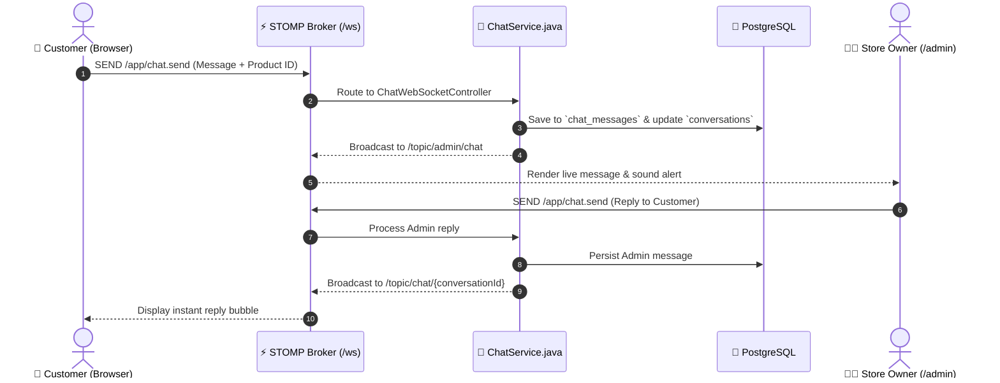

# ⚡ Quantum Core Marketplace — Enterprise Polyglot E-Commerce Platform

[](https://nextjs.org/)
[](https://react.dev/)
[](https://www.typescriptlang.org/)
[](https://spring.io/projects/spring-boot)
[](https://openjdk.org/)
[](https://www.postgresql.org/)
[](https://spring.io/guides/gs/messaging-stomp-websocket/)
[](https://stripe.com/)

---

## 📌 Executive Summary

**Quantum Core Marketplace** is an enterprise-grade, high-concurrency e-commerce ecosystem architected for high-end computer hardware, gaming rigs, workstations, and custom components. 

Designed to demonstrate modern software engineering practices, distributed systems concepts, and clean layered architecture, the platform features a reactive **Next.js 15 App Router** frontend capable of dynamically orchestrating requests across a **Polyglot Tri-Backend Architecture** (Spring Boot, Node.js, and Go).

It features **full-duplex real-time customer-to-admin chat** over WebSockets (STOMP), **ACID-compliant transactional checkouts**, **stateless JWT security with RBAC**, **anti-IDOR data protection**, and **immutable historical order pricing**.

---

## 🏛️ System Architecture

```
                                  🌐 CLIENT LAYER
                     Next.js 15 (React 19) + Vanilla CSS System
                               (http://localhost:3000)
                                        │
             ┌──────────────────────────┴──────────────────────────┐
             │                                                     │
             ▼ (HTTP REST / JWT)                                   ▼ (Full-Duplex WS)
     [ API Client Adapter ]                               [ STOMP Client Broker ]
     (Dynamic Backend Switcher)                           (SockJS + STOMP Protocol)
             │                                                     │
 ┌───────────┼───────────────────────────┐                         │
 │           │                           │                         │
 ▼           ▼                           ▼                         ▼
[PRIMARY]   [SECONDARY]                 [TERTIARY]        [REAL-TIME CHAT ENGINE]
Spring Boot 3  Node.js (Express)           Go (Gin)        /ws Handshake
Java 21        TypeScript                  High-Throughput /topic/admin/chat
Port 8080      Port 5000                   Port 8081       /user/queue/messages
 │
 ├── 🔒 Spring Security 6 (Stateless JWT Filter)
 ├── 💼 Business Logic & Service Tier (@Transactional)
 ├── 🗄️ Spring Data JPA & Hibernate ORM
 │
 ▼
🐘 PostgreSQL 18 (Port 5433 / quantumcore_db)
```

---

## 🔄 Polyglot Tri-Backend Strategy

A core architectural hallmark of Quantum Core is its **Runtime Backend Adapter Pattern**. The client is decoupled from any single backend vendor; it can dynamically toggle between backends at runtime via `localStorage` or environment variables without changing a single line of UI logic:

| Backend Tier | Core Tech Stack | Primary Database | Key Architectural Responsibility | Status |
| :--- | :--- | :--- | :--- | :--- |
| **Primary** | **Spring Boot 3.4.3 (Java 21)** | PostgreSQL 18 | Strict ACID financial integrity, order workflows, customer support chat broker, RBAC security. | **Active & Production-Ready** |
| **Secondary** | **Node.js + Express (TS)** | MongoDB (Atlas/Local)| High-speed catalog browsing, dynamic schema ingestion, product review feeds. | *Phase 2 Implementation* |
| **Tertiary** | **Go + Gin Engine** | MySQL 8 | Sub-millisecond latency microservices, telemetry, inventory reservation locks. | *Phase 3 Implementation* |

---

## 🌟 Key Engineering Highlights & Patterns

### 1. 💬 Real-Time Full-Duplex Customer ↔ Store Owner Support (STOMP over WebSocket)
* **Zero-Unmount Floating Architecture:** The `<CustomerChatWidget />` is mounted inside the Next.js `layout.tsx` using `position: fixed`. When customers navigate between categories (e.g., `/computers` $\rightarrow$ `/laptops`), the chat session, open WebSocket connection, and message state remain **100% uninterrupted**.
* **Embedded Product Card Inquiries:** Customers can click `[ 💬 Ask ]` directly from any product card. The widget auto-injects a mini interactive card preview with real-time specs and pricing into the chat stream.
* **Store Owner Inquiries Hub (`/admin/inquiries`):** Real-time administrative dashboard subscribed to `/topic/admin/chat` with instant sound alerts, canned quick-replies, and thread status toggles (`ACTIVE` / `CLOSED`).



### 2. 🛡️ Enterprise-Grade Stateless Security & Anti-IDOR Protection
* **Stateless JWT Flow:** Custom `JwtAuthenticationFilter` (`OncePerRequestFilter`) intercepts every HTTP request, verifies HMAC-SHA256 signatures, extracts user roles, and establishes the `SecurityContext`.
* **Anti-IDOR (Insecure Direct Object Reference) Safeguards:** Cart operations and order lookups strictly enforce database-level ownership via queries like `findByUserAndId(user, id)`. A malicious authenticated customer cannot access, inspect, or modify another customer’s cart or invoice.
* **BCrypt Hashing:** Salted, multi-round one-way password hashing ensures zero plaintext exposure.

### 3. 💰 Financial & Transactional Integrity (@Transactional)
* **Historical Price Immutability:** When an order is placed, `OrderService` captures an immutable snapshot of each product’s name and price at that exact second. If an administrator later alters catalog prices, past invoices and financial accounting remain completely untampered.
* **Atomic Checkout:** Cart deduction, inventory adjustments, and order creation execute inside a single atomic database transaction. If any operation fails (e.g., insufficient stock), Hibernate automatically triggers a rollback.
* **Multi-Gateway Payment Pipeline:** Supports Stripe Elements, Direct Bank Transfer, and Cash on Delivery (COD).

---

## 📂 Project Directory Structure

```
d:/PROJECTS/PERSONAL/myself/Full stack/
├── 📁 frontend/                         # Next.js 15 Client Application
│   ├── 📁 public/                       # High-res hardware imagery & assets
│   ├── 📁 src/
│   │   ├── 📁 app/                      # App Router (Pages, Layouts, Routes)
│   │   │   ├── 📁 (auth)/login & register# Customer / Admin authentication
│   │   │   ├── 📁 admin/inquiries/      # Live Store Owner Chat Command Center
│   │   │   ├── 📁 cart/                 # Interactive Shopping Cart
│   │   │   ├── 📁 checkout/             # Payment processing & Address validation
│   │   │   ├── 📁 computers/ & laptops/ # Hardware category showcases
│   │   │   ├── 📁 orders/               # Historical order dashboard
│   │   │   ├── layout.tsx               # Root Layout with persistent floating chat
│   │   │   └── page.tsx                 # Flagship landing page & hero carousel
│   │   ├── 📁 components/               # UI Component Library (Header, Cards, Chat)
│   │   │   ├── 📁 admin/                # Admin analytics & inquiry panels
│   │   │   ├── 📁 chat/                 # CustomerChatWidget, Audio alerts
│   │   │   └── ProductCard.tsx          # Dual action cards ([Add to Cart] & [💬 Ask])
│   │   ├── 📁 context/                  # Global Auth & Cart State Providers
│   │   ├── 📁 services/                 # API Client, Axios Interceptors & STOMP Service
│   │   │   └── api.ts                   # Polyglot Runtime Backend Switcher
│   │   └── 📁 types/                    # Shared TypeScript domain interfaces
│   └── package.json
│
├── 📁 backend-springboot/               # Primary Java 21 / Spring Boot 3 Engine
│   ├── 📁 src/main/java/com/quantumcore/
│   │   ├── 📁 config/                   # SecurityConfig, WebSocketConfig, CorsConfig, DataSeeder
│   │   ├── 📁 controller/               # REST Endpoints (Auth, Cart, Orders, Chat, Admin)
│   │   ├── 📁 dto/                      # Data Transfer Objects & Request/Response schemas
│   │   ├── 📁 entity/                   # JPA Domain Models (User, Product, CartItem, Order, Conversation)
│   │   ├── 📁 repository/               # Spring Data JPA Repositories
│   │   ├── 📁 security/                 # JwtUtils, JwtAuthenticationFilter, CustomUserDetailsService
│   │   ├── 📁 service/                  # Business Logic (ChatService, OrderService, CartService)
│   │   └── QuantumCoreApplication.java  # Main Application Entrypoint
│   ├── 📁 src/main/resources/
│   │   ├── application.yml              # Database, HikariCP, JPA & JWT configuration
│   │   └── products.json                # Seed hardware catalog
│   └── pom.xml
│
├── start.bat                            # Automated One-Click System Launcher
├── stop.bat                             # Clean Process Shutdown Script
└── README.md                            # System Documentation
```

---

## 📡 REST & WebSocket API Specification

### 🔐 Authentication (`/api/auth`)
| Method | Endpoint | Description | Access |
| :--- | :--- | :--- | :--- |
| `POST` | `/api/auth/register` | Register a new customer account | Public |
| `POST` | `/api/auth/login` | Authenticate credentials and issue JWT | Public |
| `GET` | `/api/auth/me` | Retrieve profile of the authenticated user | Authenticated |

### 🛒 Products & Inventory (`/api/products`)
| Method | Endpoint | Description | Access |
| :--- | :--- | :--- | :--- |
| `GET` | `/api/products` | Query catalog with filtering (category, brand) | Public |
| `GET` | `/api/products/{id}` | Retrieve detailed specs of a single item | Public |
| `POST` | `/api/products` | Create a new catalog item | `ROLE_ADMIN` |

### 🛍️ Cart & Checkout (`/api/cart` & `/api/orders`)
| Method | Endpoint | Description | Access |
| :--- | :--- | :--- | :--- |
| `GET` | `/api/cart` | Get current customer's cart | Authenticated |
| `POST` | `/api/cart` | Add product to cart (or increment quantity) | Authenticated |
| `DELETE` | `/api/cart/{id}` | Remove specific item from cart (Anti-IDOR safe) | Authenticated |
| `POST` | `/api/orders` | Place atomic order, freeze prices, flush cart | Authenticated |
| `GET` | `/api/orders` | List historical orders for customer | Authenticated |

### 💬 Real-Time Chat Engine (WebSocket STOMP + REST)
| Type | Destination / Endpoint | Purpose |
| :--- | :--- | :--- |
| **WS Handshake** | `/ws` | Establishes full-duplex WebSocket connection via SockJS |
| **WS Send** | `/app/chat.send` | Inbound client messages (persisted and routed) |
| **WS Subscribe** | `/topic/admin/chat` | Broadcast channel for Store Owner live notifications |
| **WS Subscribe** | `/topic/chat/{conversationId}` | Dedicated conversation channel for customer and admin |
| **REST GET** | `/api/chat/conversations` | Admin inquiry inbox (paginated / filtered by status) |
| **REST GET** | `/api/chat/active` | Retrieve or initiate customer's active thread |

---

## 🚀 Quickstart & Installation

### Prerequisites
* **Java Development Kit (JDK 21+)**
* **Node.js (v18.18+ or v20+)**
* **PostgreSQL 18** running on port `5433` (or configured port)
* **Maven** (bundled Maven wrapper `./mvnw` is provided)

---

### Option A: ⚡ Automated One-Click Launch (Windows)

Simply double-click or run from PowerShell:
```powershell
.\start.bat
```
* Automatically verifies Node.js and Java 21 environments.
* Starts the Spring Boot backend on **`http://localhost:8080`**.
* Starts the Next.js frontend on **`http://localhost:3000`**.
* Run `.\stop.bat` to cleanly terminate all processes when finished.

---

### Option B: 🛠️ Manual Step-by-Step Launch

#### 1. Setup the Database
Create the database in PostgreSQL:
```sql
CREATE DATABASE quantumcore_db;
```
Verify `backend-springboot/src/main/resources/application.yml` has your credentials:
```yaml
spring:
  datasource:
    url: jdbc:postgresql://localhost:5433/quantumcore_db
    username: postgres
    password: ${DB_PASSWORD:postgres}
```

#### 2. Start the Spring Boot Backend
```bash
cd backend-springboot
./mvnw clean spring-boot:run
```
*(Hibernate will automatically create all tables and `DataSeeder` will seed default products and user accounts).*

#### 3. Start the Next.js Frontend
```bash
cd frontend
npm install
npm run dev
```
Open **`http://localhost:3000`** in your browser.

---

## 🔑 Pre-Seeded Demonstration Accounts

For interviewers or reviewers exploring the system, the database is pre-configured with the following credentials upon first startup:

| Account Type | Email | Password | Role | Permissions |
| :--- | :--- | :--- | :--- | :--- |
| **Store Owner (Admin)** | `admin@quantumcore.com` | `admin123` | `ROLE_ADMIN` | Access `/admin/inquiries`, product creation, full inventory management |
| **Demo Customer** | `customer@quantumcore.com` | `customer123` | `ROLE_CUSTOMER` | Browse, Add to Cart, Live Chat, Checkout, Order History |

---

## 🗺️ Engineering Roadmap

- [x] **Phase 1: Full Stack Core (Completed)**
  - Next.js 15 App Router with responsive cyberpunk dark UI design system.
  - Spring Boot 3.4.3 backend with PostgreSQL 18 & Hibernate ORM.
  - Stateless JWT Authentication with BCrypt & custom Security Filters.
  - Real-time STOMP WebSocket chat with persistent layout widget & Admin Hub.
  - Stripe & multi-gateway checkout with atomic price-snapshot transactions.
- [ ] **Phase 2: Polyglot Node.js Engine (Next Milestone)**
  - Express.js + Mongoose (MongoDB) service on port `5000` for dynamic catalog indexing and customer reviews.
- [ ] **Phase 3: High-Performance Go Service**
  - Gin-based Go microservice on port `8081` for sub-millisecond stock availability checks.
- [ ] **Phase 4: Containerization & Cloud Orchestration**
  - Full Docker Compose stack orchestrating PostgreSQL, MongoDB, Spring Boot, Node.js, and Next.js.

---

## 📄 License
This project is open-source and licensed under the [MIT License](LICENSE).
